# flutter_template
Flutter project template

本项目为个人学习Flutter的练习项目。

基本包含了日常开发中常用的组件。

同时使用了Getx，使整个项目框架目录结构清晰，非常适合学习借鉴。

## 预览
部分页面效果如下：
| |   | 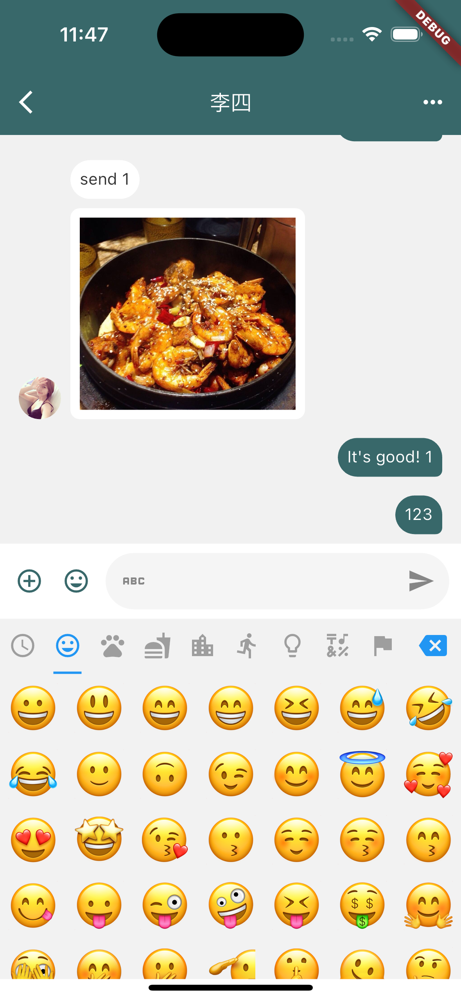  | 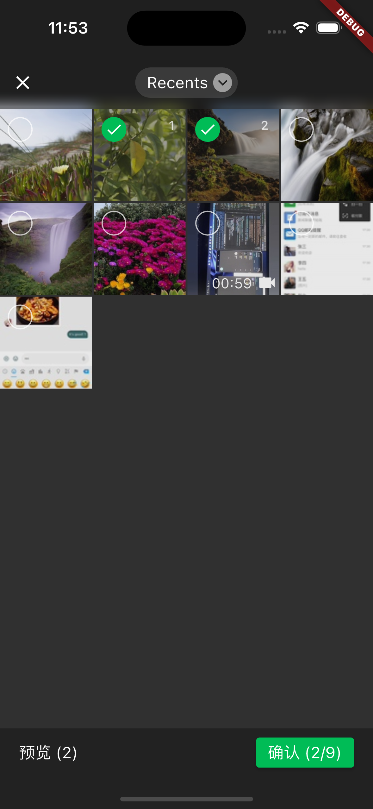  |
| :--: | :--: | :--: | :--: |
|  | 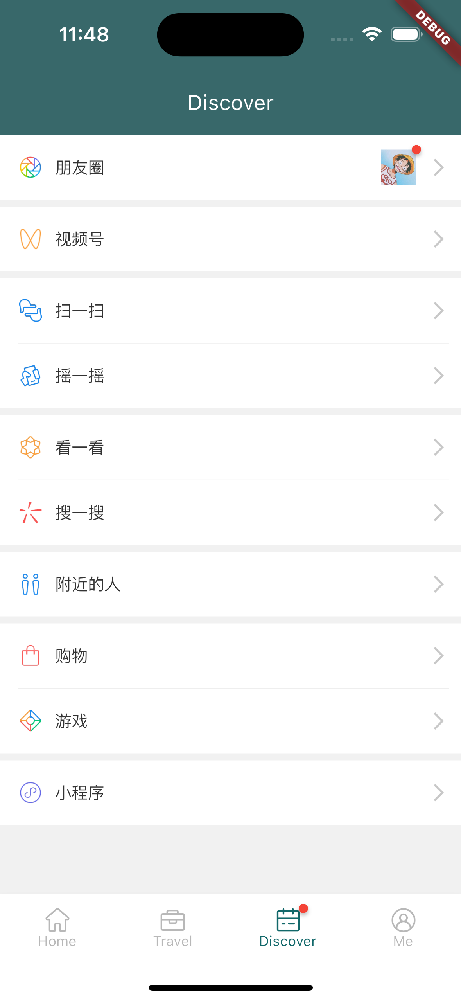  |   | 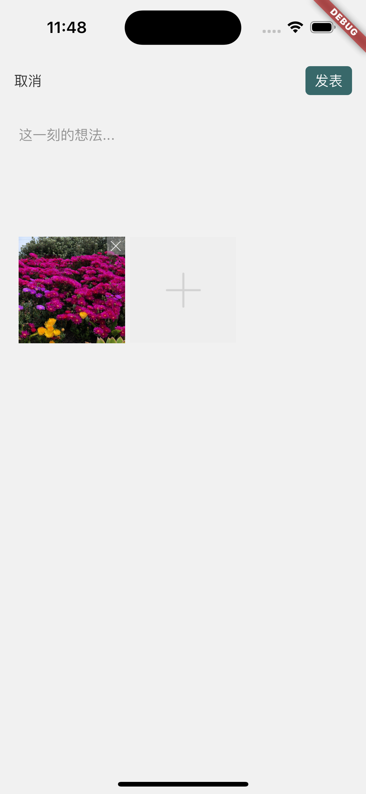  |
| 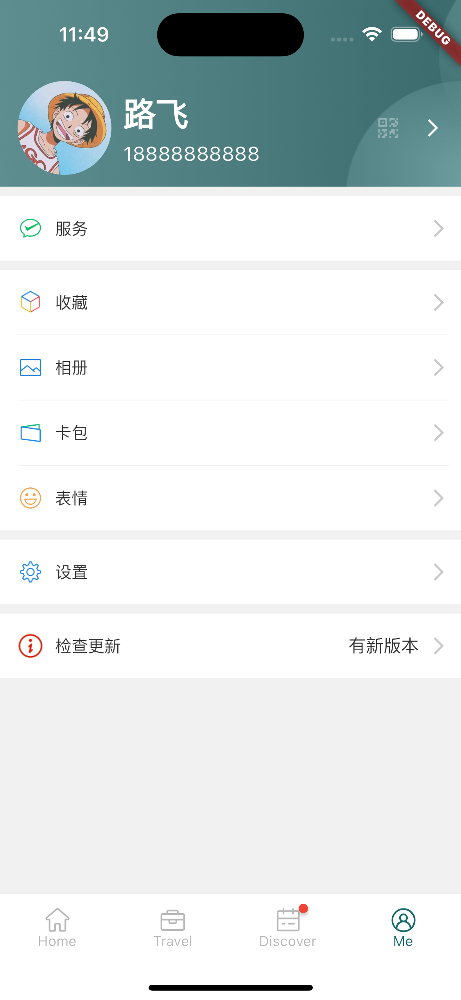 | 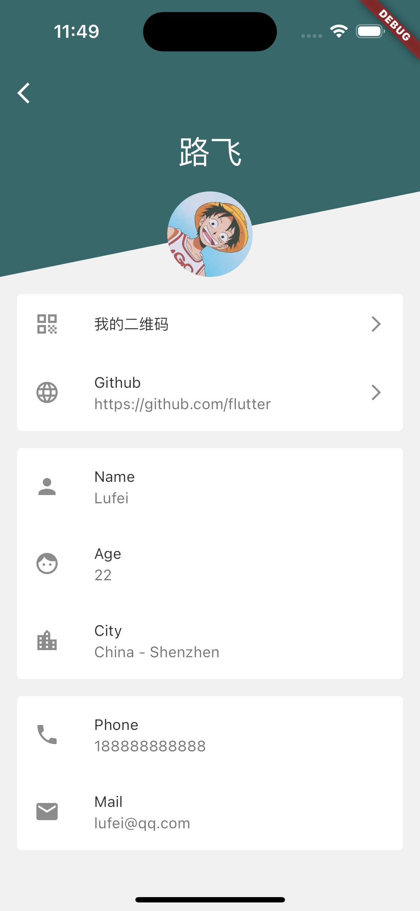  |   | 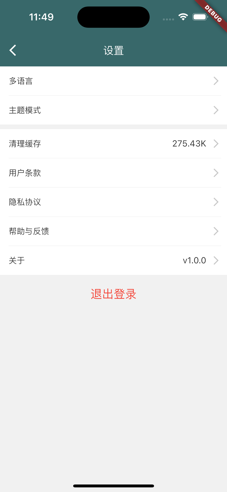  |
|  | 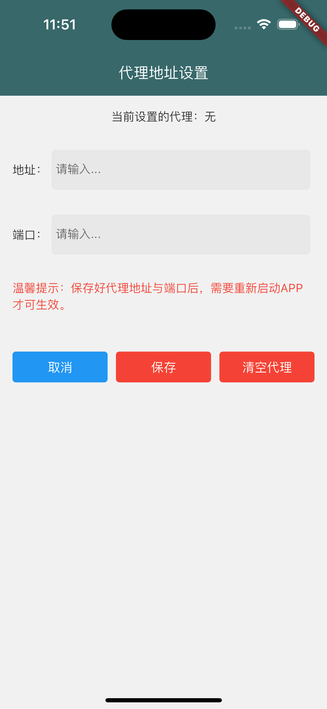  |   | 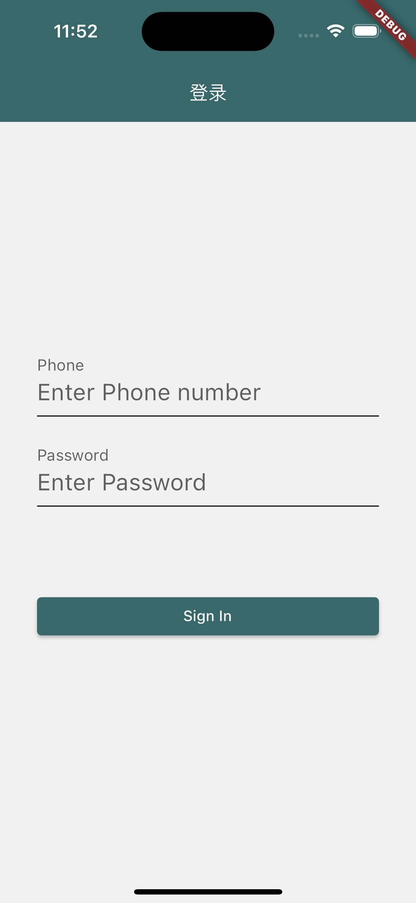  |

## 项目框架
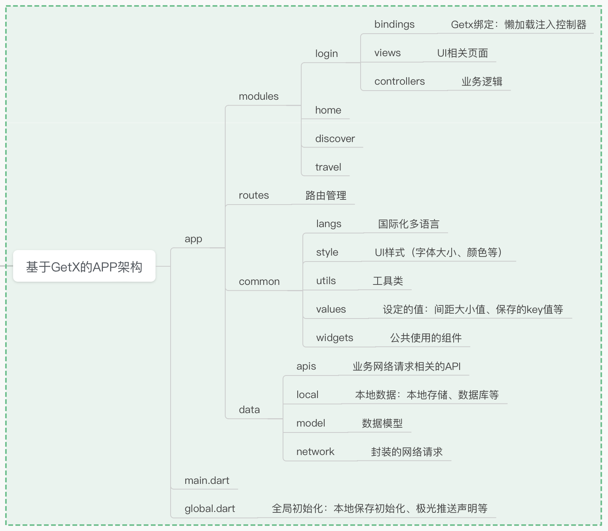


## 实现的内容
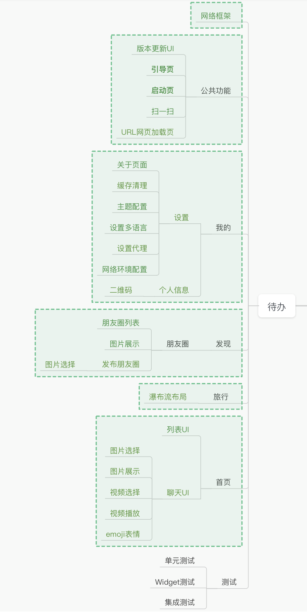

## 后续计划
* [ ] 添加单元测试
* [ ] 添加widget测试
* [ ] 添加集成测试
* [ ] 优化项目大小

## 使用到的第三方库
下方只是列出部分，具体可查看项目文件[pubspec.yaml](flutter_project_template/pubspec.yaml)
| 库 |  功能 |
| :-- | :-- |
| dio| 网络库 |
| get| Flutter 上的一个轻量且强大的解决方案：高性能的状态管理、智能的依赖注入和便捷的路由管理。 |
| shared_preferences| 本地化存储 |
| fluttertoast| 弹框 |
| flutter_screenutil| 屏幕参数适配 |
| encrypt| 加密 |
| connectivity_plus| 监测网络状态 |
| flutter_slidable| 侧滑删除 |
| badges| 小红点 |
| qr_code_scanner| 二维码扫描 |
| flutter_staggered_grid_view| 瀑布流 |
| webview_flutter| web页面跳转 |
| url_launcher| url跳转 |
| easy_refresh| 上下拉加载 |
| flutter_spinkit| 常用的动态图标 |
| emoji_picker_flutter| emoji图标选择 |
| wechat_assets_picker| 类似微信的多媒体选择 |
| wechat_camera_picker| 类似微信的照相机 |
| video_player| 多媒体播放器 |
| path_provider| 文件路径 |
| permission_handler| 应用权限申请处理 |


# 本项目运行环境

```Flutter
[✓] Flutter (Channel stable, 3.13.6, on macOS 13.0 22A8380 darwin-arm64, locale zh-Hans-CN)
    • Flutter version 3.13.6 on channel stable at ~/development/flutter
    • Upstream repository https://github.com/flutter/flutter.git
    • Framework revision ead455963c (2 weeks ago), 2023-09-26 18:28:17 -0700
    • Engine revision a794cf2681
    • Dart version 3.1.3
    • DevTools version 2.25.0
    • Pub download mirror https://pub.flutter-io.cn
    • Flutter download mirror https://storage.flutter-io.cn

[✓] Android toolchain - develop for Android devices (Android SDK version 33.0.2)
    • Android SDK at /Users/huangguozan/Library/Android/sdk
    • Platform android-33, build-tools 33.0.2
    • Java binary at: /Applications/Android Studio.app/Contents/jbr/Contents/Home/bin/java
    • Java version OpenJDK Runtime Environment (build 17.0.6+0-17.0.6b802.4-9586694)
    • All Android licenses accepted.

[✓] Xcode - develop for iOS and macOS (Xcode 14.3)
    • Xcode at /Applications/Xcode.app/Contents/Developer
    • Build 14E222b
    • CocoaPods version 1.12.1

[✓] Chrome - develop for the web
    • Chrome at /Applications/Google Chrome.app/Contents/MacOS/Google Chrome

[✓] Android Studio (version 2022.2)
    • Android Studio at /Applications/Android Studio.app/Contents
    • Flutter plugin can be installed from:
      🔨 https://plugins.jetbrains.com/plugin/9212-flutter
    • Dart plugin can be installed from:
      🔨 https://plugins.jetbrains.com/plugin/6351-dart
    • Java version OpenJDK Runtime Environment (build 17.0.6+0-17.0.6b802.4-9586694)

[✓] VS Code (version 1.82.0)
    • VS Code at /Applications/Visual Studio Code.app/Contents
    • Flutter extension version 3.74.0

[✓] Connected device (4 available)
    • sdk gphone64 arm64 (mobile) • emulator-5554                        • android-arm64  • Android
      13 (API 33) (emulator)
    • iPhone 14 Pro (mobile)      • 16D4E680-B564-4E3C-BECA-8E64D028082B • ios            •
      com.apple.CoreSimulator.SimRuntime.iOS-16-4 (simulator)
    • macOS (desktop)             • macos                                • darwin-arm64   • macOS
      13.0 22A8380 darwin-arm64
    • Chrome (web)                • chrome                               • web-javascript • Google
      Chrome 117.0.5938.149

[✓] Network resources
    • All expected network resources are available.
```

## 运行项目注意事项
下载代码后，在工程目录下命令运行flutter pub get，然后就可以使用 VSCode或者Android Studio打开工程编译运行项目。

注意自己当前的flutter版本，本项目使用的是最新的Flutter 3.13.6版本，如果你使用的是其他版本，注意查看第三方库wechat_assets_picker/wechat_camera_picker使用的版本是否对应正确，因为这个库未做全版本适配，需自行选择对应版本，具体请查看[wechat_assets_picker](https://pub.dev/packages/wechat_assets_picker) | [wechat_camera_picker](https://pub.dev/packages/wechat_camera_picker)

登录页面只校验了长度，输入足够长度内容即可跳转进入主页面（可自行根据业务设置校验）


