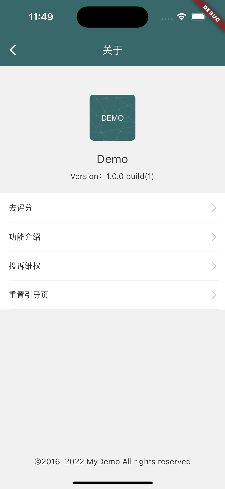

# flutter_template
Flutter project template

本项目为个人学习Flutter的练习项目。

基本包含了日常开发中常用的组件。

同时使用了Getx，使整个项目框架目录结构清晰，非常适合学习借鉴。

# 项目运行环境
```Flutter
1. Flutter version 3.13.6
2. Dart version 3.1.3
```

# 预览
部分页面效果如下：
| |   |   |   |
| :--: | :--: | :--: | :--: |
|  |   |   |   |
|  |   |   |   |
|  |   |   |   |

# 项目框架


# 实现的内容


# 使用到的第三方库

| 库 |  功能 |
| :-- | :-- |
| dio| 网络库 |
| get| Flutter 上的一个轻量且强大的解决方案：高性能的状态管理、智能的依赖注入和便捷的路由管理。 |
| shared_preferences| 本地化存储 |
| fluttertoast| 弹框 |
| flutter_screenutil| 屏幕参数适配 |
| encrypt| 加密 |
| connectivity_plus| 监测网络状态 |
| flutter_slidable| 侧滑删除 |
| badges| 小红点 |
| qr_code_scanner| 二维码扫描 |
| flutter_staggered_grid_view| 瀑布流 |
| webview_flutter| web页面跳转 |
| url_launcher| url跳转 |
| easy_refresh| 上下拉加载 |
| flutter_spinkit| 常用的动态图标 |
| emoji_picker_flutter| emoji图标选择 |
| wechat_assets_picker| 类似微信的多媒体选择 |
| wechat_camera_picker| 类似微信的照相机 |
| video_player| 多媒体播放器 |
| path_provider| 文件路径 |
| permission_handler| 应用权限申请处理 |
